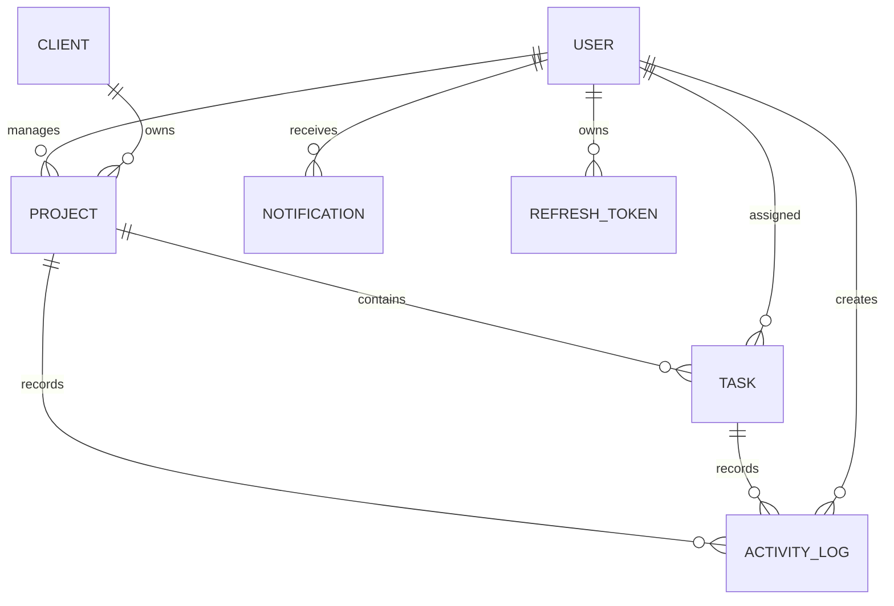

# Real-Time Client Project Dashboard

## Overview

A role-aware project delivery dashboard for managing clients, projects, tasks, activity, and notifications. It uses PostgreSQL for durable application state and Socket.IO for immediate activity, notification, and presence updates without polling.

## Features

- JWT access tokens with rotating, hashed refresh tokens stored in HttpOnly cookies
- Backend-enforced RBAC for Admin, Project Manager, and Developer roles
- Client projects and task management with ownership checks
- Shareable task filters for status, priority, and due-date range
- Persistent activity feed with Socket.IO delivery and PostgreSQL catch-up
- Persistent private notifications, read states, and a live unread badge
- Multi-tab-safe online-user presence for the Admin dashboard
- Scheduled overdue-task processing with duplicate protection

## Tech Stack

**Frontend:** React, TypeScript, Vite, Axios, React Router, Socket.IO Client  
**Backend:** Node.js, Express, TypeScript, Prisma, PostgreSQL, JWT, Socket.IO, Zod, node-cron  
**Infrastructure:** Docker PostgreSQL; Vercel-ready frontend

## Architecture

```text
Browser
  ↓
React + Axios / Socket.IO Client
  ↓
Express API + Socket.IO server
  ↓
Service layer
  ↓
Prisma
  ↓
PostgreSQL
```

The overdue-task scheduler runs in the backend process, updates durable task state, writes an activity record, and emits an authorized real-time activity event.

## Role-Based Access

| Feature | Admin | Project Manager | Developer |
| --- | --- | --- | --- |
| Projects | All | Owned projects | No access |
| Tasks | All | Tasks in owned projects | Assigned tasks only |
| Task editing | Full | Owned-project tasks | Status only, assigned tasks |
| Activity | Global | Owned-project activity | Assigned-task activity |
| Dashboard | Global metrics | Own projects | Own tasks |
| Notifications | Own | Own | Own |

Authorization is enforced by authenticated backend routes and service-level ownership checks; UI visibility is not the security boundary.

## Database Schema



Core entities are `User`, `Client`, `Project`, `Task`, `ActivityLog`, `Notification`, and `RefreshToken`. Prisma indexes support common ownership, task-filter, activity, notification, and refresh-token queries.

## Local Development

1. Start PostgreSQL using the repository Docker setup and configure `backend/.env`.
2. Install dependencies in `backend` and `frontend`.
3. Generate Prisma Client and seed the development database:

   ```bash
   cd backend
   npx prisma generate
   npx prisma db seed
   ```

4. Run the apps in separate terminals:

   ```bash
   cd backend && npm run dev
   cd frontend && npm run dev
   ```

## Demo Credentials

All seeded accounts use `Password@123`.

| Role | Email |
| --- | --- |
| Admin | `admin@dashboard.com` |
| Project Manager | `ravi.manager@dashboard.com` |
| Project Manager | `priya.manager@dashboard.com` |
| Developer | `arun.dev@dashboard.com` |
| Developer | `meena.dev@dashboard.com` |
| Developer | `karthik.dev@dashboard.com` |
| Developer | `sneha.dev@dashboard.com` |

## Verification

```bash
cd backend && npm run build && npx prisma validate
cd frontend && npm run build
```
